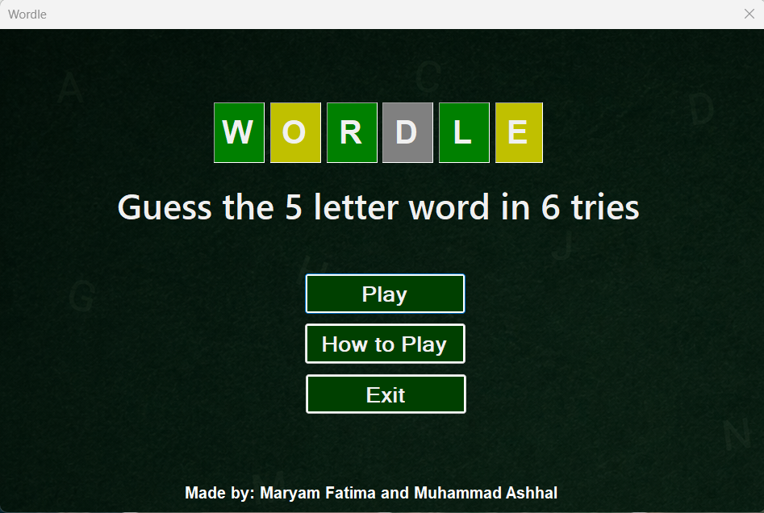
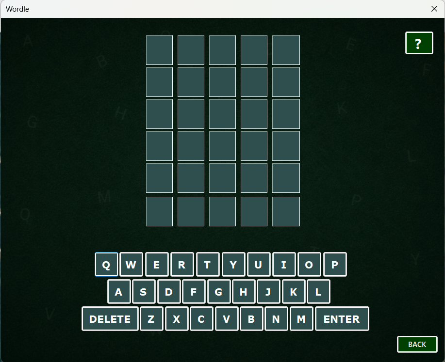
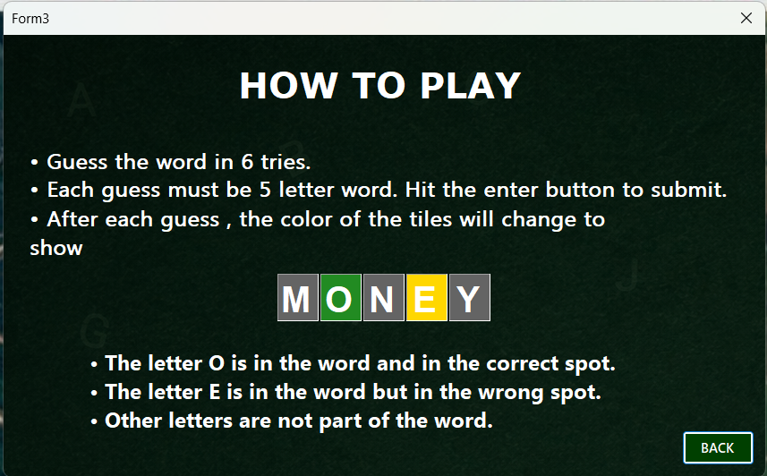

# Wordle Game

A Wordle-inspired desktop game developed as a Semester-End Project for the Object-Oriented Programming (OOP) course using C# and Windows Forms (.NET Framework).

## Overview

Wordle Game is a desktop application that challenges players to guess a randomly selected 5-letter word within 6 attempts. The project was developed to apply Object-Oriented Programming concepts in a practical environment while also exploring GUI development and file handling.

## Features

* Interactive Home Screen
* Wordle-style Gameplay
* On-Screen Keyboard
* Random Word Selection
* How To Play Section
* User-Friendly Interface
* File Handling using an External Text File

## Project Structure

### Form 1 – Home Page

The main menu of the application containing:

* Play Button
* How To Play Button
* Exit Button

### Form 2 – Game Screen

The core gameplay interface featuring:

* Word Input Grid
* Virtual Keyboard
* Guess Validation
* Win/Loss Detection

### Form 3 – How To Play

Provides instructions and rules for playing the game.

## File Handling

The project uses an external text file named **Alfaaz.txt** that contains a collection of words. A random word is selected from this file each time a new game starts.

## Technologies Used

* C#
* Windows Forms (.NET Framework)
* Visual Studio

## OOP Concepts Applied

* Classes and Objects
* Encapsulation
* Event Handling
* Modular Programming
* File Handling

## Screenshots

### Home Page

### Gameplay

### How To Play

## Learning Outcomes

This project provided practical experience in:

* Building GUI-based desktop applications
* Applying Object-Oriented Programming concepts
* Managing multiple Windows Forms
* Working with external files
* Debugging and problem-solving

## Developers

* Muhammad Ashhal
* Maryam Fatima

## Course

Object-Oriented Programming (OOP)

Semester-End Project
